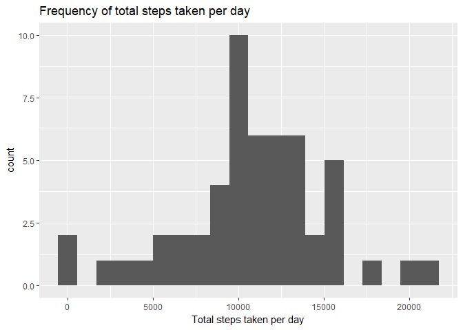
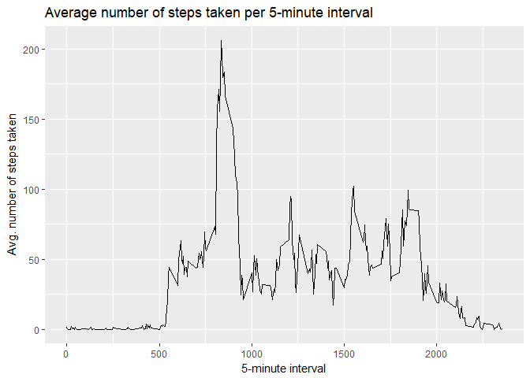
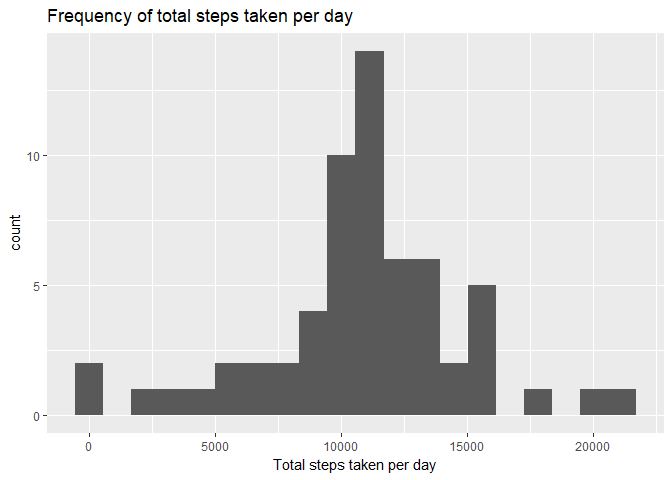
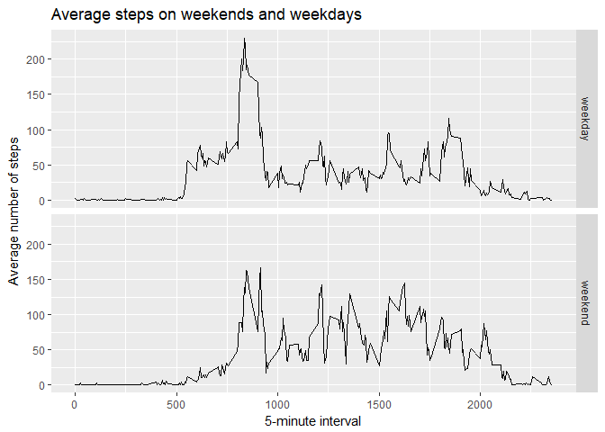

## Introduction

Following is an analysis of some activity recorded on a personal monitoring device.
The dataset can be found [here](https://d396qusza40orc.cloudfront.net/repdata%2Fdata%2Factivity.zip).

Let's load the libraries we need:

```r
library(tidyverse)
```

## Loading and preprocessing the data

We download and extract the data below:


```r
data.file <- "activity.csv"
if (!file.exists(data.file)) { # if the data file does not exist, extract it from the archive
        zip.file <- "repdata_data_activity.zip"
        if (!exists(zip.file)) { # if the archive does not exist, download it
                download.file("https://d396qusza40orc.cloudfront.net/repdata%2Fdata%2Factivity.zip", destfile=zip.file, mode="wb")
        }
        unzip(zip.file)
}

activity <- read.csv(data.file, colClasses=c("numeric", "Date", "numeric"))
```

The variables included in this dataset are:

  * **steps**: Number of steps taken in a 5-minute interval (missing values are coded as `NA`)
  * **date**: The date on which the measurement was taken in YYYY-MM-DD format
  * **interval**: Identifier for the 5-minute interval in which measurement was taken
  
Let's examine it for ourselves.


```r
str(activity)
```

```
## 'data.frame':	17568 obs. of  3 variables:
##  $ steps   : num  NA NA NA NA NA NA NA NA NA NA ...
##  $ date    : Date, format: "2012-10-01" "2012-10-01" ...
##  $ interval: num  0 5 10 15 20 25 30 35 40 45 ...
```

```r
summary(activity)
```

```
##      steps             date               interval     
##  Min.   :  0.00   Min.   :2012-10-01   Min.   :   0.0  
##  1st Qu.:  0.00   1st Qu.:2012-10-16   1st Qu.: 588.8  
##  Median :  0.00   Median :2012-10-31   Median :1177.5  
##  Mean   : 37.38   Mean   :2012-10-31   Mean   :1177.5  
##  3rd Qu.: 12.00   3rd Qu.:2012-11-15   3rd Qu.:1766.2  
##  Max.   :806.00   Max.   :2012-11-30   Max.   :2355.0  
##  NA's   :2304
```

## What is mean total number of steps taken per day?

Now let's examine the total number of steps taken each day:

```r
per.day <- activity %>% group_by(date) %>%
           summarize(total_steps=sum(steps))

ggplot(na.omit(per.day), aes(x=total_steps)) + geom_histogram(bins=20) + labs(x="Total steps taken per day", title="Frequency of total steps taken per day")
```

<!-- -->

We saw the mean and median of steps taken over all days when we summarized `activity`, but let's take the mean and median of total steps over each day:


```r
mean(per.day$total_steps, na.rm=T)
```

```
## [1] 10766.19
```

```r
median(per.day$total_steps, na.rm=T)
```

```
## [1] 10765
```

Looks like our source managed to get in his/her 10k steps!

## What is the average daily activity pattern?

Now let's compute the average number of steps taken in each 5-minute interval:


```r
per.5 <- na.omit(activity) %>% group_by(interval) %>%
         summarize(avg_steps=mean(steps))

ggplot(per.5, aes(x=interval, y=avg_steps)) + geom_path() + labs(x="5-minute interval", y="Avg. number of steps taken", title="Average number of steps taken per 5-minute interval")
```

<!-- -->

Which 5-minute interval, on average across all the days in the dataset, contains the maximum number of steps?


```r
per.5[which(per.5$avg_steps == max(per.5$avg_steps)), 1]
```

```
## # A tibble: 1 x 1
##   interval
##      <dbl>
## 1     835.
```

## Imputing missing values

What's the total number of rows with missing values? Well, we saw this in `summary`:


```r
summary(activity)
```

```
##      steps             date               interval     
##  Min.   :  0.00   Min.   :2012-10-01   Min.   :   0.0  
##  1st Qu.:  0.00   1st Qu.:2012-10-16   1st Qu.: 588.8  
##  Median :  0.00   Median :2012-10-31   Median :1177.5  
##  Mean   : 37.38   Mean   :2012-10-31   Mean   :1177.5  
##  3rd Qu.: 12.00   3rd Qu.:2012-11-15   3rd Qu.:1766.2  
##  Max.   :806.00   Max.   :2012-11-30   Max.   :2355.0  
##  NA's   :2304
```

Turns out we have **2304** rows with `NA` values.

The *R for Data Science* book has [a whole section](http://r4ds.had.co.nz/tidy-data.html#missing-values-3) on missing values.
One insight that comes from this is the distinction between **implicit** and **explicit** missing values, i.e., observations which are missing altogether, and observations with `NA` in one or more feature.
Let's first see if we have any implicit missing values by computing the Cartesian product of `date` and `interval` and filling in any which where missing with `NA`:


```r
dim(activity %>% complete(date, interval))
```

```
## [1] 17568     3
```

```r
dim(activity)
```

```
## [1] 17568     3
```

Turns out we don't need to worry about that! All combinations of `date` and `interval` are accounted for.

I happen to like a strategy of keeping the interval mean the same, so let's fill in those missing values with the mean for that 5-minute interval over all days:


```r
filled.activity <- activity
for (ival in per.5$interval) {
        avg_steps <- per.5 %>% filter(interval==ival) %>% select(avg_steps)
        filled.activity[is.na(filled.activity$steps)&filled.activity$interval==ival,1] <- avg_steps
}

summary(filled.activity)
```

```
##      steps             date               interval     
##  Min.   :  0.00   Min.   :2012-10-01   Min.   :   0.0  
##  1st Qu.:  0.00   1st Qu.:2012-10-16   1st Qu.: 588.8  
##  Median :  0.00   Median :2012-10-31   Median :1177.5  
##  Mean   : 37.38   Mean   :2012-10-31   Mean   :1177.5  
##  3rd Qu.: 27.00   3rd Qu.:2012-11-15   3rd Qu.:1766.2  
##  Max.   :806.00   Max.   :2012-11-30   Max.   :2355.0
```

What is the impact of imputing missing data on the estimates of the total daily number of steps?


```r
filled.per.day <- filled.activity %>% group_by(date) %>%
           summarize(total_steps=sum(steps))

ggplot(filled.per.day, aes(x=total_steps)) + geom_histogram(bins=20) + labs(x="Total steps taken per day", title="Frequency of total steps taken per day")
```

<!-- -->

Our new histogram looks pretty close to the one with the missing data, with only a fatter bump in the middle.
What about the mean and median of the filled data set? How have these changed?


```r
mean(filled.per.day$total_steps)
```

```
## [1] 10766.19
```

```r
median(filled.per.day$total_steps)
```

```
## [1] 10766.19
```

Our mean hasn't changed at all (we might have expected that) and our median is now exactly the same as our mean!

## Are there differences in activity patterns between weekdays and weekends?

Let's transform our data to make this easier to see:


```r
wd <- weekdays(filled.activity$date)
wd <- replace(wd, which(wd %in% c("Saturday", "Sunday")), "weekend")
wd <- replace(wd, which(!(wd %in% c("Saturday", "Sunday", "weekend"))), "weekday")
filled.activity$weekday <- as.factor(wd)

filled.summary <- filled.activity %>% group_by(weekday, interval) %>% summarize(avg_steps=mean(steps))
```

Now let's plot it:


```r
ggplot(filled.summary, aes(x=interval, y=avg_steps)) + geom_path() +
        facet_grid(weekday~.) + labs(title="Average steps on weekends and weekdays", x="5-minute interval", y="Average number of steps")
```

<!-- -->

We can see that on weekdays, our data source walked mostly in the early part of the day, whereas on the weekend, walking is more evenly distributed during waking hours.
